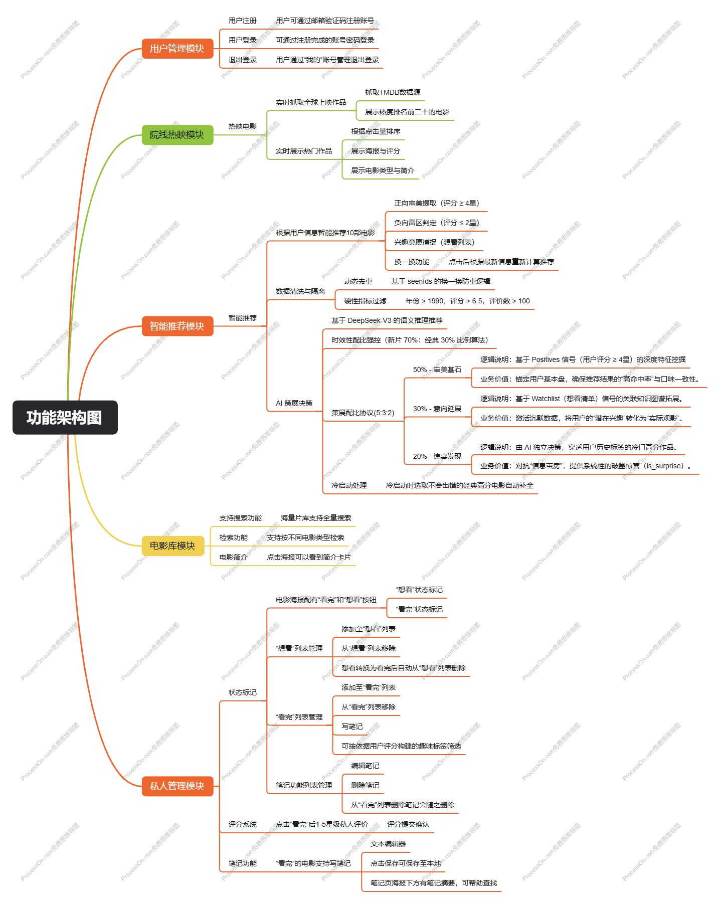
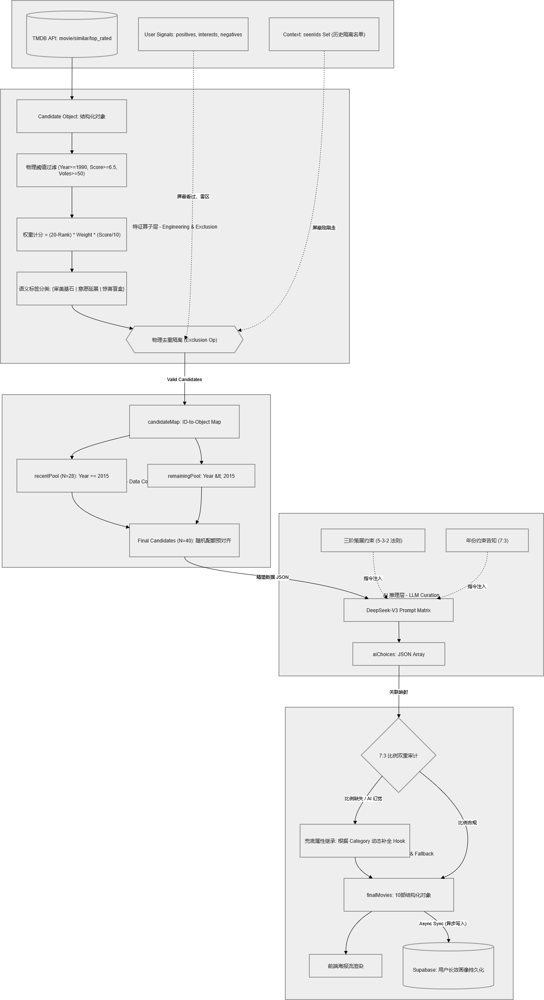
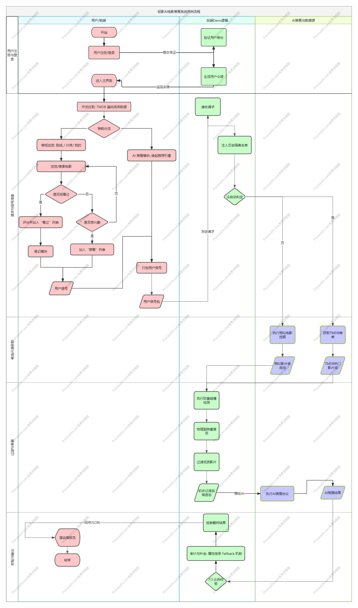

# qingying-docs
# 🚀 轻影 II | 架构设计与竞品分析中心
> **[🔗 点击进入：轻影 II 在线交互演示页面](https://qingying.vercel.app/)**

欢迎来到“轻影 II”的设计文档库。这里记录了项目从逻辑架构到市场分析的完整思考过程。

---

## 🎨 逻辑架构原稿
> 好的设计始于清晰的逻辑推演。

### 1. 功能架构图

### 2. 数据架构图

### 3. 用户用例流程图

---

## 📄 深度文档
如果想查看更详细的市场定位与产品分析，请参阅下方 PDF 文档：

👉 [**点击预览：《轻影》竞品分析报告 (PDF)**](./《轻影》竞品分析报告.pdf)

---
